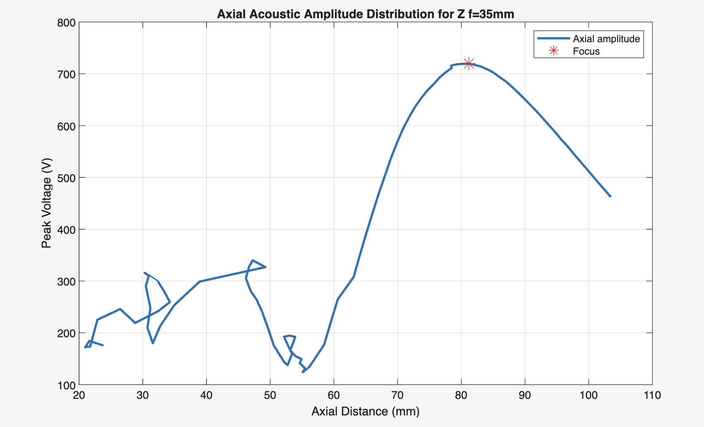
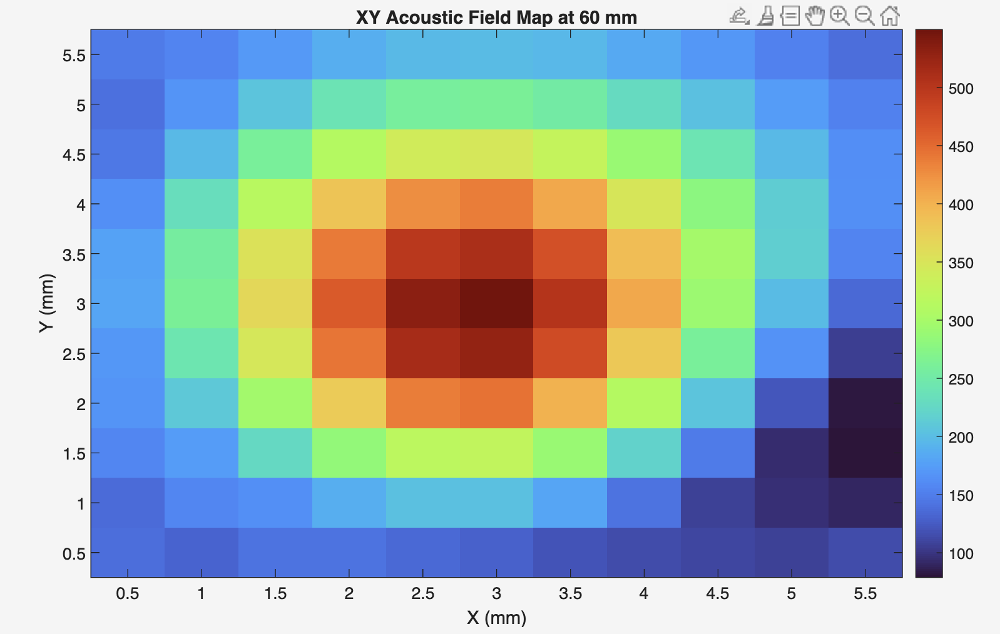
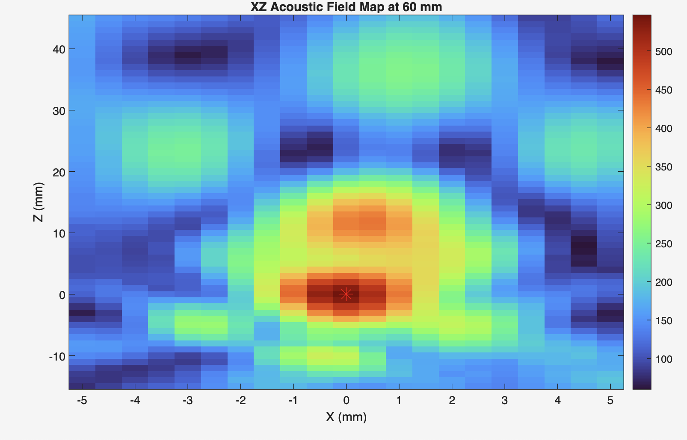
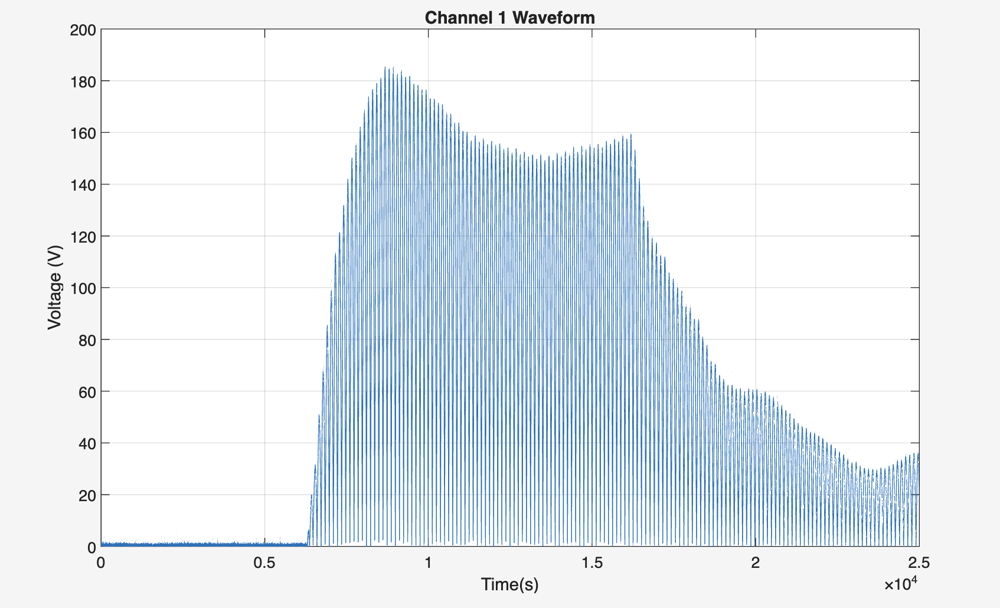

# Raster.m

This repository contains a MATLAB script for analyzing raster-scan acoustic data and estimating focal characteristics from waveform measurements.

## What the script does

The script in Raster.m:

- loads several MATLAB data files containing raster-scan waveforms,
- extracts the peak voltage from each waveform,
- generates calibration curves for different input settings,
- analyzes axial scans to estimate:
  - focal position,
  - maximum amplitude,
  - focal region length.

## Supported analysis

The current workflow includes:

- calibration curves for real axial focus and programmed focus,
- axial amplitude analysis for:
  - Z focus = 30 mm,
  - Z focus = 35 mm,
  - Z focus = 25 mm at 5 W/cm².

## Data requirements

The script expects MATLAB data files (.mat) in the same folder. Each file should contain a variable named `rasterscandata`, and the script reads waveform data from that variable.

Example files used by the script include:

- `RealAxialFocus_5mA_RasterScan.mat`
- `RealAxialFocus_10mA_RasterScan.mat`
- `ProgrammedFocus_10mA_RasterScan.mat`
- `AxialFocus_30mm_RasterScan.mat`
- `AxialFocus_35mm_RasterScan.mat`
- `AxialFocus_25mm_5Wcm2_RasterScan.mat`

## How to run

1. Open MATLAB.
2. Change the current folder to the directory containing this repository.
3. Run:

```matlab
run('Raster.m')
```

## Notes

- The script uses hard-coded file names and parameter values such as:
  - sampling frequency: `125e6 Hz`
  - speed of sound in water: `1485 m/s`
- It is currently tailored to the provided dataset and file naming convention.
- If you use different data files, update the file names and any relevant parameters in the script.

## Expected output

Running the script generates:

- calibration plots for peak voltage versus Ispta setting,
- axial amplitude plots for the scan positions,
- focal point estimates and focal region measurements printed in the MATLAB command window.

### Example output

A typical result from the axial-focus analysis is a plot of peak voltage versus Ispta setting, together with printed output such as:

```text
Focal position at 30f for Z = 32.10 mm
Maximum amplitude at 30f for Z = 0.4823 V
Focal region length at 30f for Z = 4.20 mm
```

These values are derived from the waveform data stored in the raster-scan files and provide a simple description of the acoustic focus behaviour.

## Example images

Below are example outputs from the raster scan analysis, shown as images stored in this repository:

- **Axial Acoustic Amplitude Distribution**:  — shows peak voltage versus axial distance for the 30 mm focus scan.
- **XY Acoustic Field Map**:  — shows the lateral acoustic field distribution at 60 mm and the measured beam focus.
- **XZ Acoustic Field Map**:  — shows the cross-sectional acoustic profile for the 25 mm or 35 mm field scan.
- **Channel 1 Waveform**:  — shows a representative time-domain waveform for one transmit channel.

These images illustrate the type of plots the script produces and help communicate the measured beam patterns and focus metrics.

## Future work

Possible improvements include:

- adding pressure conversion from voltage using hydrophone sensitivity,
- making the file names and parameters configurable,
- generalizing the script for additional scan datasets.
